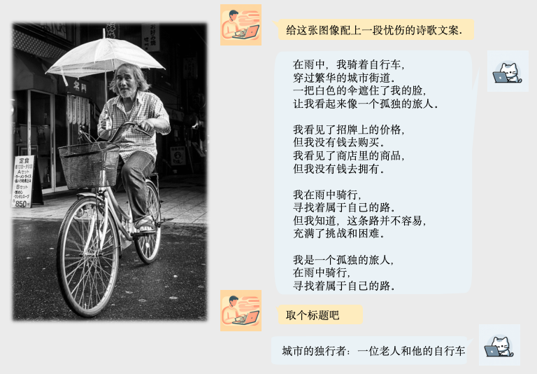
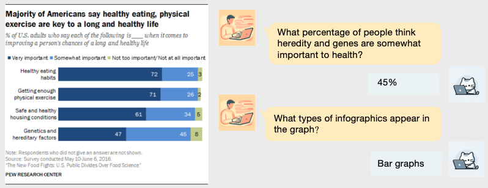
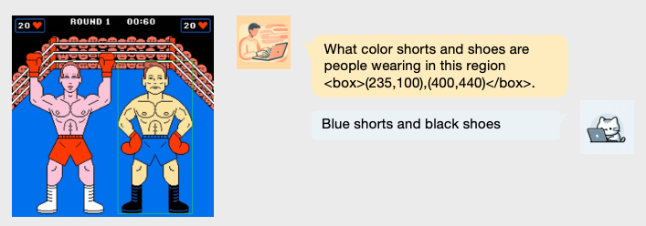
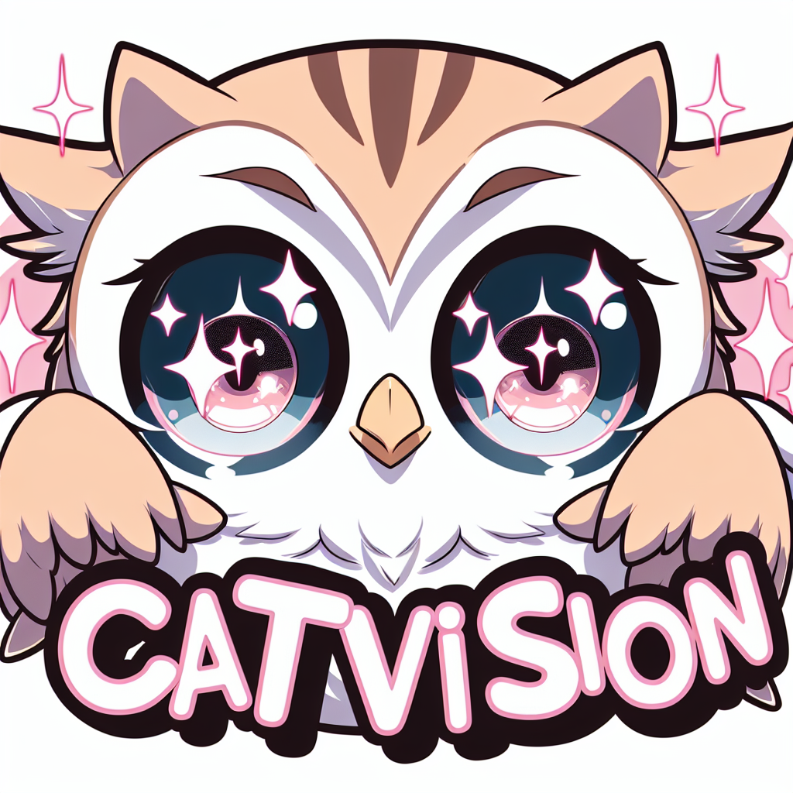

# CatVision

## Introduction

A multimodal large-scale model, characterized by its open-source nature, closely emulates the functionalities of the GPT4V/Qwen-VL-Plus model. Built upon the foundation of Qwen-72b-Chat, CatVision in handling inputs that combine both images and text. This model is designed to effectively follow instructions for output formats, benefiting from the strengths of Qwen72b. 

一个开源多模态大模型，紧密模拟了GPT4V/Qwen-VL-PLUS系列模型的功能。该模型建立在Qwen-72b-Chat的基础上，可以处理包含交错的图文输入。该模型从Qwen72b的优势中受益，旨在有效地遵循输出格式指令。

Our model performs close to the closed-source Qwen-VL-PLUS on many datasets and significantly surpasses the performance of the open-source model Qwen-VL-7B-Chat.

我们的模型在很多数据集上，接近闭源的Qwen-VL-PLUS的效果，并大幅超过开源模型Qwen-VL-7B-Chat的效果。

- Our training approach consisted of two stages, inspired by LLava1.5. In the initial stage, we trained the visual encoder + perceptual resampler, and in the second stage, we focused on training the large language model + perceptual resampler with instructional data. To overcome limited computational resources (32xA100-80G), we used Lora for training in both stages.

受LLava1.5启发，我们的训练分为两个阶段：在初始阶段，我们训练了视觉编码器+感知重采样器；在第二阶段，我们专注于使用视觉指令数据训练大型语言模型+感知重采样器。为了克服有限的计算资源(32xA100-80G)，我们在两个阶段都使用了Lora进行培训。

- During the first stage, our training data included samples from ShareGPT4V and CC12M. As we progressed to the second stage, our training dataset encompassed ShareGPT4V fine-tune data, LVIS Instruct4V, OCR data, InforGraphics/Chart QA data, and data sourced from region descriptions in VG.

在第一阶段，我们的训练数据包括来自ShareGPT4V和CC12M的样本。第二阶段，我们的训练数据集包括ShareGPT4V微调数据、LVIS Instruct4V、OCR数据、信息图表问答数据以及从VG区域描述中获取的数据。

- The visual encoding part is inherited from Qwen-VL-Chat, i.e., Openclip ViT-bigG.

视觉编码部分继承自Qwen-VL-Chat，即Openclip ViT-bigG。

- We are continuously collecting instruction data, optimizing the model, and looking forward to supporting more tasks.

我们正在持续收集指令数据，优化模型，期待能支持更多的功能。

## Quick Start

```
from transformers import AutoTokenizer, AutoModelForCausalLM, AutoConfig
tokenizer = AutoTokenizer.from_pretrained(
    pretrained_model_name_or_path="huizhang0110/CatVision",
    model_max_length=8192,
    padding_side="left",
    trust_remote_code=True
)
config = AutoConfig.from_pretrained(
    pretrained_model_name_or_path="huizhang0110/CatVision",
    trust_remote_code=True
)
model = AutoModelForCausalLM.from_pretrained(
    pretrained_model_name_or_path="huizhang0110/CatVision",
    config=config,
    device_map="auto", 
    trust_remote_code=True
).eval()
query = "demo.jpg</img>\n介绍一下这张图像！"
response, history = model.chat(
    tokenizer,
    query=query,
    history=None,
)
```

## Benchmark

Our model achieved favorable results on the many leaderboards.

- **[MMMU](https://eval.ai/web/challenges/challenge-page/2179/leaderboard/5377)**

| Model                          | Val (900) | Test (11K)   |
|--------------------------------|:---------:|:------------:|
| Gemini Ultra                   |   59.4    |     ----     |
| GPT4V                          |   56.8    |     55.7     |
| Gemini Pro                     |   47.9    |     ----     |
| Yi-VL-34B                      |   45.9    |     41.6     |
| Qwen-VL-PLUS                   |   45.2    |     40.8     |
| **CatVision**                  |   45.9    |     40.1     |
| Macro-VL                       |   41.2    |     40.4     |
| InfiMM-Zephyr-7B                |   39.4    |     35.5     |
| Yi-VL-6B                       |   39.1    |     37.8     |
| SVIT                           |   38.0    |     34.1     |
| LLaVA-1.5-13B                  |   36.4    |     33.6     |
| Emu2-Chat                      |   36.3    |     34.1     |
| Qwen-VL-7B-Chat                |   35.9    |     32.9     |

- **[CMMMU](https://github.com/CMMMU-Benchmark/CMMMU/blob/main/README.md)**

| Model                          | Val (900) | Test (11K)   |
|--------------------------------|:---------:|:------------:|
| GPT-4V(ision) (Playground)     |   42.5    |     43.7     |
| Qwen-VL-PLUS*                  |   39.5    |     36.8     |
| **CatVision**                  |   39.6    |     ----     |
| Yi-VL-34B                      |   36.2    |     36.5     |
| Yi-VL-6B                       |   35.8    |     35.0     |
| Qwen-VL-7B-Chat                |   30.7    |     31.3     |
| InternVL-Chat-ViT-6B-Vicuna-7B |   26.4    |     26.7     |
| InternVL-Chat-ViT-6B-Vicuna-13B|   27.4    |     26.1     |
| CogAgent-Chat                  |   24.6    |     23.6     |
| Emu2-Chat                      |   23.8    |     24.5     |
| Chinese-LLaVA                  |   25.5    |     23.4     |
| VisCPM                         |   25.2    |     22.7     |
| mPLUG-OWL2                     |   20.8    |     22.2     |
| Frequent Choice                |   24.1    |     26.0     |
| Random Choice                  |   21.6    |     21.6     |

- **[MMBench](https://mmbench.opencompass.org.cn/leaderboard)**

| Model               | mmbench_cn (test) | mmbench_cn (dev) | mmbench_en (test) | mmbench_zh (dev) | ccbench | 
|---------------------|:-----------------:|:----------------:|:-----------------:|:----------------:|:-------:|
| Qwen-VL-PLUS(BASE)  | 83.3              | 83.2             | 82.7              | 81.5             | 77.6    |
| GPT4v               | 77.0              | 75.1             | 74.4              | 75.0             | 46.5    |
| Qwen-VL-PLUS        | 67.0              | 66.2             | 70.7              | 69.6             | 55.1    |
| **CatVision**       | 70.9              | 71.8             | 70.2              | 71.6             | 49.8    |
| Qwen-VL-Chat        | 61.8              | 60.6             | 56.3              | 56.7             | 41.2    |

- **[MME](https://github.com/BradyFU/Awesome-Multimodal-Large-Language-Models)**

| Model         | Perception | Cognition | 
|---------------|:----------:|:---------:|
| GPT4v         | 1409.43    | 517.14    |
| Qwen-VL-PLUS  | 1681.25    | 502.14    |
| **CatVision** | 1560.90    | 366.43    |
| Qwen-VL-Chat  | 1487.57    | 360.71    |

- **Open Compress**

wait

- **Show Case**

*图像描述*



*信息图表*



*区域理解*



## Citation 

```
@misc{CatVision,
  author = {zhanghui@4paradigm.com},
  title = {CatVision},
  year = {2024},
  publisher = {huggingface},
  howpublished = {\url{https://huggingface.co/huizhang0110/CatVision}}
}
```



